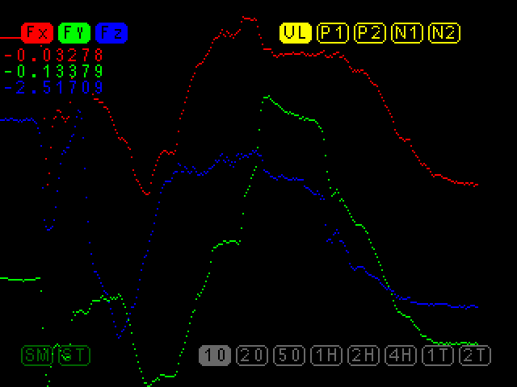

# AK09940A LCD demo

This folder contains a demonstration program showcasing the functionality
of a magnetometer sensor using the STM32 F4VE board
and an LCD display included in the kit. The program features a straightforward
graphical user interface (GUI) for configuring sensor parameters.

## Overview

The demonstration program is designed to work with the STM32 F4VE development
board and a compatible LCD display. It provides a GUI interface to configure
sensor parameters such as measurement frequency and Drive.
The display includes buttons for enabling/disabling the display of
measurement (`Fx`, `Fy`, `Fz`). Additionally, there are yellow buttons
(`UL`, `P1`, `P2`, `N1`, `N2`) for selecting drive (ultra-low power, low power
1 or 2, low noise 1 or 2). Green buttons `SM` and `ST` set the operation mode
to single measurement or self test. Grey buttons (`10`, `20`, `50`, `1H`, `2H`,
`4H`, `1T`, `2T`) set the continuous measurement mode and control the
measurement frequency (from 10 HZ to 2500 Hz).

## Requirements

* STM32 F4VE development board
* Any AK09940A module
* Compatible LCD display/touch panel included in the kit
* Development environment compatible with STM32F4 microcontrollers

## Setup

* Attach AK09940A by I2C to PB9 (SDA), PB8 (SCL)
* Attach the LCD display to the designated port on the STM32F4VE board.
* Connect the STM32 F4VE board to your development environment.

## Usage

Compile and upload the program to the STM32 F4VE board. Upon successful upload,
the demonstration program will run, displaying sensor data on the LCD screen.
Activate the buttons on the GUI interface using the touch panel.
Simply touch the corresponding button on the LCD screen to toggle its state.
